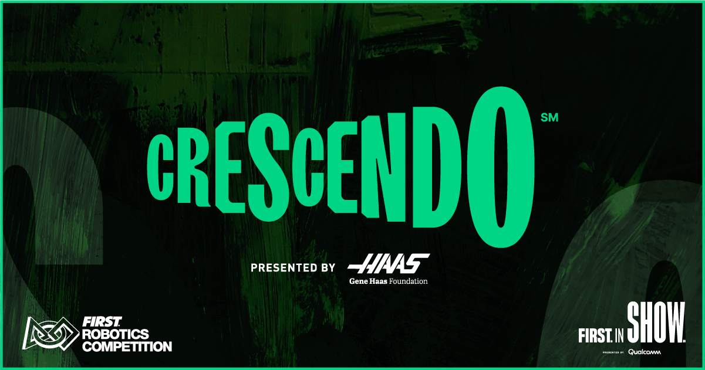
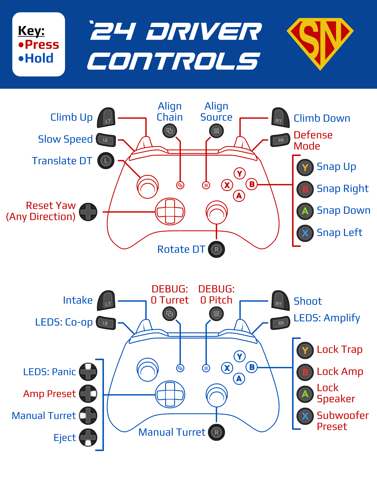

# Shang-Chi - FRC Team 3255's 2024 Robot
Jump into the code [`here!`](src/main/java/frc/robot)

Shang-Chi competed at the regional level in the following competitions: 
- [Port Hueneme](https://www.thebluealliance.com/event/2024caph)
- [San Diego](https://www.thebluealliance.com/event/2024casd)

## View Shang-Chi in Action!
- [Instagram](https://www.instagram.com/frcteam3255/) 
- [YouTube (Primary)](https://www.youtube.com/@FRC3255)
- [YouTube (Clips)](https://www.youtube.com/@FRC3255Clips)
- [Build Thread (Chief Delphi)](https://www.chiefdelphi.com/t/frc-3255-supernurds-2024-build-thread/447181)
- [Website](https://supernurds.com)

## What is CRESCENDO?

CRESCENDO, presented by Haas, is the 2024 Season of the FIRST Robotics Competition. Each season has its unique objectives and limitations. 
Students have 6 weeks to construct a robot to compete in the season. Once the 6 weeks are up, teams compete at regional or district-level 
competitions (depending on region) to qualify for the FIRST Championship in Houston, Texas.

Interested in learning more about CRESCENDO? Visit [FIRST's website](https://www.firstinspires.org/robotics/frc/game-and-season) for more details!

## San Diego Regional
At the end of qualification matches at SDR, Shang-Chi ranked 2nd of 51 teams. As captain of the 2nd seeded alliance, our team chose [Team 2102 Team Paradox](https://www.thebluealliance.com/team/2102/2024) and [Team 3341 Option 16](https://www.thebluealliance.com/team/3341/2024). Our alliance made it to semifinals before being eliminated, ultimately placing 4th overall.

## Controls
