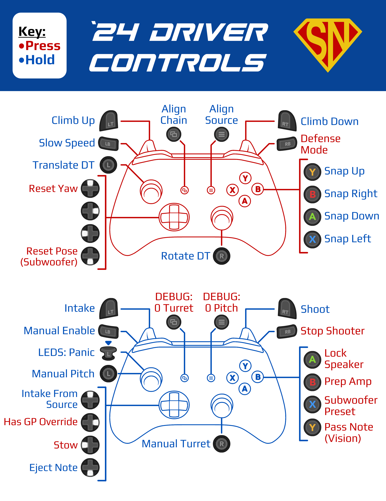
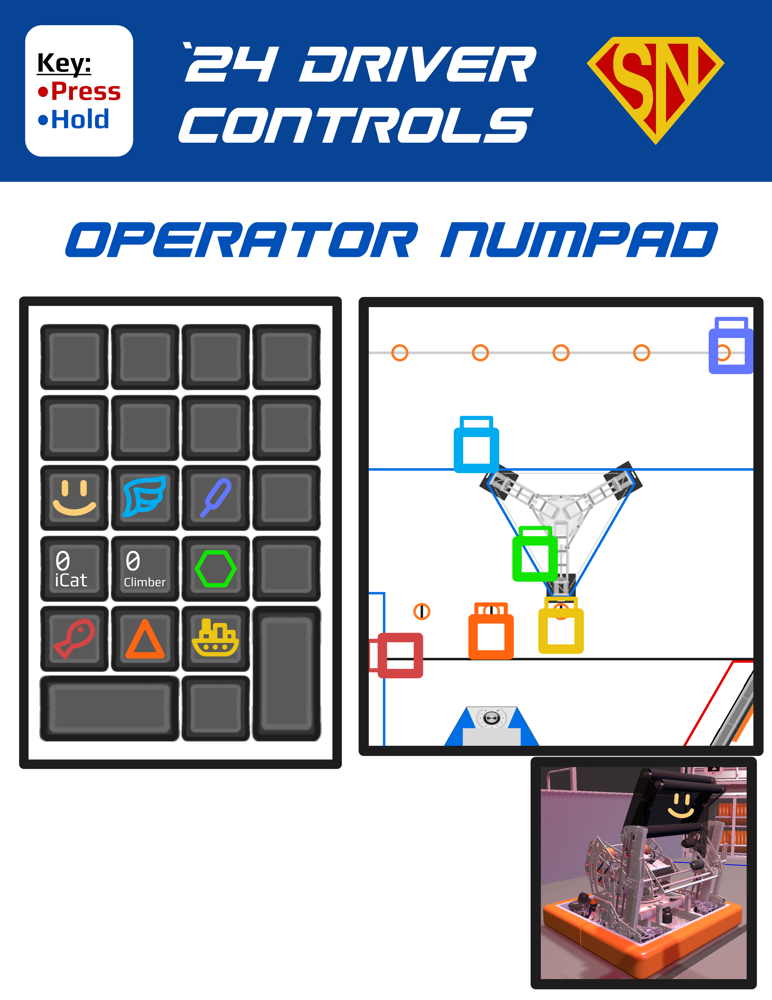

# Shang-Chi - FRC Team 3255's 2024 Robot
Jump into the code [`here!`](src/main/java/frc/robot)

Shang-Chi competed at the regional level in the following competitions: 
- [Port Hueneme](https://www.thebluealliance.com/event/2024caph)
- [San Diego](https://www.thebluealliance.com/event/2024casd)

At the end of qualification matches at SDR, Shang-Chi ranked 2nd of 51 teams. We ultimately placed 4th as the 2nd seeded alliance with [Team 2102 Team Paradox](https://www.thebluealliance.com/team/2102/2024) and [Team 3341 Option 16](https://www.thebluealliance.com/team/3341/2024)!

## View Shang-Chi in Action!
- [Instagram](https://www.instagram.com/frcteam3255/) 
- [YouTube (Primary)](https://www.youtube.com/@FRC3255)
- [YouTube (Clips)](https://www.youtube.com/@FRC3255Clips)
- [Build Thread (Chief Delphi)](https://www.chiefdelphi.com/t/frc-3255-supernurds-2024-build-thread/447181)
- [Website](https://supernurds.com)

## What is CRESCENDO?

CRESCENDO, presented by Haas, is the 2024 Season of the FIRST Robotics Competition. Each season has its unique objectives and limitations. 
Students have 6 weeks to construct a robot to compete in the season. Once the 6 weeks are up, teams compete at regional or district-level 
competitions (depending on region) to qualify for the FIRST Championship in Houston, Texas.

Interested in learning more about CRESCENDO? Visit [FIRST's website](https://www.firstinspires.org/robotics/frc/game-and-season) for more details!

## Robot Features
Our code is written off of WPI’s Command-Based libraries and framework and utilizes our team's own vendor library, [SuperCORE](https://github.com/FRCTeam3255/SuperCORE). All of our subsystems implement Supply current limiting at high voltages in order to prevent motors burning out and mechanisms breaking. Similarly, all of our positionally controlled subsystems have a zeroing fallback if their position is inaccurate. We turn off current limiting, run the motor at a slow speed, and detect a current spike before to zero the subsystem's position.
### Shooter
- The hood uses the y-coordinate of the robot's pose to linearly interpolate the angle to shuffle notes from our robot's position.
- The flywheels are controlled seperately and can be set to different speeds and PID values. They begin to get up to speed as soon as we collect a game piece and are set to neutral output once we shoot out the game piece.
- The turret uses trigonometry to determine the angle to shuffle notes from our robot's position.
### Elevator
- The elevator is set to neutral output when it is close to 0 to conserve battery.
### Intake/Transfer
- Our game piece detection relies on current and voltage. We detect the spike in the current on our rollers when a game piece is collected.
- We briefly push back the game piece when it is collected using time-based methods, setting the game piece to a consistent position before shooting it. We also position the game piece for amp placement using encoder-based methods.
### Drivetrain
- 
### LEDs
- The LEDs are controlled using CTRE's CANdle. They flash when we are intaking and turn solid when a game piece is collected.

## Controls

